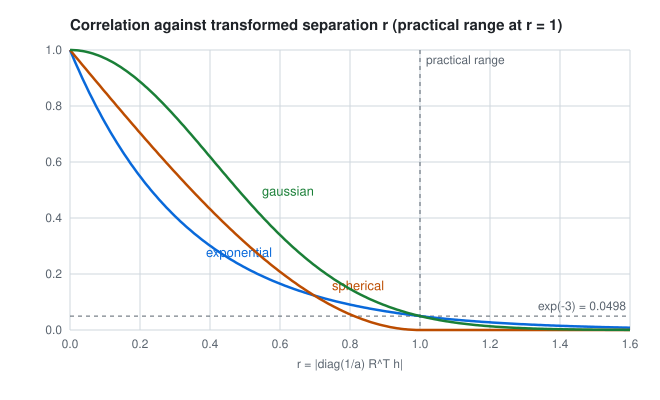

# Covariance models

`geocond.covariance` holds the nested stationary covariance every conditioning method in GeoCond uses: three
correlation families, geometric anisotropy through a principal frame, and the linear model of coregionalization for
several variables. `geocond.conventions` converts between it and the range conventions of gstat, PyKrige and GSTools.

## One structure

A component has a correlation family, three positive practical principal ranges $a_1, a_2, a_3$, a proper rotation
$R$ whose columns are the principal directions, and a sill. It evaluates its correlation on the transformed separation

$$r = \left\lVert \operatorname{diag}(1/a_1, 1/a_2, 1/a_3)\, R^{\mathsf T} \mathbf h \right\rVert,$$

so a separation of one practical range along a principal direction has $r = 1$ whatever the direction. The three
families use the practical-range convention:

$$\rho_\text{exp}(r) = e^{-3r}, \qquad
\rho_\text{sph}(r) = \begin{cases} 1 - \tfrac32 r + \tfrac12 r^3 & r < 1 \\ 0 & r \ge 1 \end{cases}, \qquad
\rho_\text{gau}(r) = e^{-3r^2}.$$

<picture>
  <source media="(prefers-color-scheme: dark)" srcset="../assets/correlation-families-dark.svg">
  
</picture>

The exponential and Gaussian correlations reach $e^{-3} \approx 0.0498$ at the practical range: a convention, not an
exact 95% point (that distance is $-\tfrac{a}{3}\ln 0.05$ for the exponential). The spherical correlation reaches zero
there and stays at zero.

`principal_frame(azimuth, dip, rake)` builds $R$ with the conventions of `Survey`: the major direction has its azimuth
clockwise from north and its dip negative downward; the semi-major direction starts horizontal, 90 degrees clockwise of
the major azimuth, and both it and the minor direction turn about the major one by the rake; the frame is right handed.
A per-domain global anisotropy is a defensible starting model. Giving each sample-to-target pair its own rotation can
destroy the covariance's symmetry or positive definiteness, so locally varying anisotropy needs a separately valid
nonstationary construction and is not offered as a cosmetic control.

## Several variables: the linear model of coregionalization

For $p$ variables every component shares one correlation structure and anisotropy, and carries a $p \times p$ sill
matrix $B_k$:

$$C_{ab}(\mathbf h) = N_{ab}\,[\mathbf h = \mathbf 0] + \sum_k (B_k)_{ab}\, \rho_k(\mathbf h), \qquad
B_k \succeq 0, \quad N \succeq 0.$$

If every $\rho_k$ is a valid correlation and every $B_k$ is positive semidefinite, every covariance matrix assembled
from the model is positive semidefinite (Genton and Kleiber 2015). The check is on the full spectrum: for two
variables each structure needs $B_{11} B_{22} \ge B_{12}^2$, but for three or more, pairwise inequalities are not
enough. The test suite carries a three-variable matrix whose three pairwise inequalities all hold and whose smallest
eigenvalue is negative; the model rejects it. A sufficient construction for fitting is $B_k = L_k L_k^{\mathsf T}$.

`CovarianceModel.variable(a)` returns the direct model of one variable, which is what a cokriging system must reduce to
when every cross coefficient is zero.

## Nugget and observation error

The nugget $N$ is the process nugget: a microscale structure present at exactly zero separation and nowhere else. The
model gives it at $\mathbf h = \mathbf 0$ only; at $10^{-9}$ m it is gone, as in gstat (`[0.1, 0, 0]` at lags
`[0, 1e-9, 1]`, the reference fixture's value). With a process nugget, prediction at an observation's exact location
reproduces the observation. Independently noisy duplicate assays are a different thing: measurement error is declared
with the observations and targets the latent process, so it is not part of a covariance model.

## Other libraries' ranges

Libraries that share a model name do not share its range. Each conversion below was measured by evaluating the
library's own function on a separation grid (`tests/test_conventions.py`):

| Library, model | Library correlation | GeoCond practical range |
|---|---|---|
| gstat `Exp(a)` | $e^{-h/a}$ | $3a$ |
| gstat `Sph(a)` | spherical, zero at $a$ | $a$ |
| gstat `Gau(a)` | $e^{-(h/a)^2}$ | $\sqrt3\, a$ |
| PyKrige exponential, range $r$ | $e^{-h/(r/3)}$ | $r$ |
| PyKrige spherical, range $r$ | spherical, zero at $r$ | $r$ |
| PyKrige gaussian, range $r$ | $e^{-(h/(4r/7))^2}$ | $\sqrt3 \cdot 4r/7$ |
| GSTools Exponential, `len_scale` $l$ | $e^{-h/l}$ | $3l$ |
| GSTools Spherical, `len_scale` $l$ | spherical, zero at $l$ | $l$ |
| GSTools Gaussian, `len_scale` $l$ | $e^{-(\pi/4)(h/l)^2}$ | $l\sqrt{12/\pi}$ |

The adapters (`from_gstat`, `to_gstat`, `from_pykrige`, `to_pykrige`, `to_gstools`) convert isotropic univariate
models, the form all three share. PyKrige's one-dimensional hole-effect model is not a valid arbitrary 3D covariance
and is refused. Anisotropic and multivariate models are compared by evaluated covariance, never by passing the same
parameter vector to two libraries.

## What the tests establish

| Question | Test | Result |
|---|---|---|
| Does the LMC evaluate what gstat evaluates? | `test_evaluated_lmc_covariances_match_gstat`: the reference fixture's two-variable LMC (a nugget, an exponential and a spherical structure, three nonproportional PSD matrices) at seven lags, direct and cross | agreement within 2e-10 at every lag |
| Are the recorded component spectra reproduced? | `test_component_eigenvalues_match_the_recorded_spectra` | yes |
| Does rotating space and the frame together change anything? | `test_rotating_space_and_the_frame_together_changes_nothing`, 200 random separations | no, to 1e-13 |
| Is an assembled three-variable LMC covariance PSD? | 40 random points, two structures, random PSD sills | smallest eigenvalue above -1e-10 |
| Do the library conventions hold? | gstat, PyKrige and GSTools functions evaluated on a grid | agreement to 1e-13 |

## References

- Genton, M. G. and Kleiber, W. Cross-covariance functions for multivariate geostatistics. *Statistical Science* 30,
  147-163 (2015). doi:10.1214/14-STS487
- Goulard, M. and Voltz, M. Linear coregionalization model: tools for estimation and choice of cross-variogram
  matrix. *Mathematical Geology* 24, 269-286 (1992). doi:10.1007/BF00893750
- Pebesma, E. and Graeler, B. gstat: prediction references and `fit.lmc`. https://r-spatial.github.io/gstat/ (the
  parity fixture was computed by gstat 2.1-6, commit 2a578765502dd29520dcc3b40af42c953237faa3).
- Müller, S., Schüler, L., Zech, A. and Heße, F. GSTools v1.3: a toolbox for geostatistical modelling in Python.
  *Geoscientific Model Development* 15, 3161-3182 (2022). doi:10.5194/gmd-15-3161-2022
- GeoStat Framework. PyKrige variogram models, version 1.7.3.
  https://geostat-framework.readthedocs.io/projects/pykrige/en/stable/variogram_models.html
