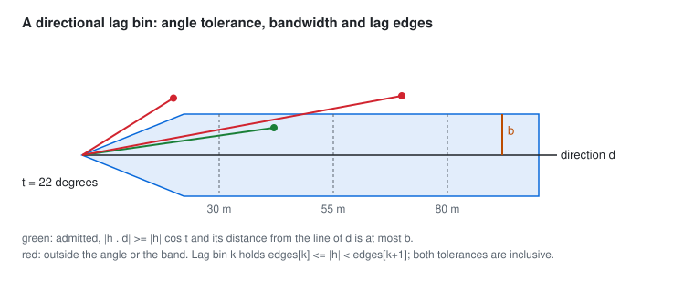

# Experimental variograms and fitting

`geocond.variogram` estimates direct and cross semivariograms from observations and fits nested covariance models to
them. It returns the evidence with the estimate: bin edges, the actual mean separation in each bin, pair counts, the
retained pairs, and for a fit, every start, its objective and its convergence.

## Estimators

For the pairs $P(\mathbf h)$ that fall in one lag bin, with $N(\mathbf h)$ pairs, the classical (Matheron) estimator is

$$\hat\gamma(\mathbf h) = \frac{1}{2N(\mathbf h)} \sum_{(i,j) \in P(\mathbf h)} (z_i - z_j)^2 .$$

The Cressie-Hawkins robust estimator (Cressie and Hawkins 1980) works on square roots of the absolute differences:

$$\hat\gamma(\mathbf h) = \frac{\left[\frac{1}{N} \sum |z_i - z_j|^{1/2}\right]^4}{2\left(0.457 + 0.494/N + 0.045/N^2\right)},$$

with the bias correction that includes the $0.045/N^2$ term, the form GSTools 1.7.0 implements (citing Webster and
Oliver 2007). A robust estimator limits the influence of extreme differences; it does not repair wrong coordinates or
mixed assay supports.

For two variables observed on the same supports, the classical cross semivariogram is

$$\hat\gamma_{ab}(\mathbf h) = \frac{1}{2N(\mathbf h)} \sum (a_i - a_j)(b_i - b_j).$$

It needs genuinely common supports. Variables sampled at different places are never paired by proximity to make a
cross-variogram: restrict them to common supports first, or use a model that handles unequal sampling.

## Which pairs enter which bin

Every rule is stated so a test can place a pair exactly on it.

<picture>
  <source media="(prefers-color-scheme: dark)" srcset="../assets/directional-bin-dark.svg">
  
</picture>

- Pairs are unordered, $i < j$. Pairs at exactly zero separation are excluded and reported as coincident.
- Lag bin $k$ holds $e_k \le |\mathbf h| < e_{k+1}$. A pair exactly on an interior edge belongs to the upper bin; one
  exactly on the last edge belongs to none.
- A direction $\mathbf d$ with angle tolerance $t$ admits a pair when the line through $\mathbf h$ is within $t$ of
  $\mathbf d$: $|\mathbf h \cdot \mathbf d| \ge |\mathbf h| \cos t$. A bandwidth $b$ admits it when its distance from
  the line of $\mathbf d$ is at most $b$. Both are inclusive, to a relative $10^{-12}$ so a pair built exactly on a
  boundary is not lost to rounding.
- A downhole variogram pairs only observations of the same hole and measures separation in measured depth. It answers
  a different question from a spatial directional variogram, which uses the desurveyed 3D separation.

The tolerances trade angular specificity against pairs per bin. Low-count bins stay visible as weak evidence: the
counts come with every estimate.

**Sampling.** On large data `max_pairs` draws a seeded uniform sample of the candidate pairs without replacement. The
result records the population size, that it was sampled, and the seed; the same seed gives the same pairs.

## Fitting

`fit_variogram` fits nested families (and a nugget unless disabled) to one or more direct experimental variograms by
bounded weighted least squares:

$$\min_\theta \sum_{m} \sum_{b} w_{mb} \left(\hat\gamma_{mb} - \gamma_\theta(\bar h_{mb}\, \mathbf d_m)\right)^2,$$

where $\bar h_{mb}$ is the actual mean separation of bin $b$ of variogram $m$ and $\mathbf d_m$ its direction. The
weights are the pair counts (default), the pair counts over the squared lag, or uniform, normalized to sum to one.
Weighting by counts alone can overweight dense drilling; the objective and the bins used are part of the record.

An anisotropic fit estimates three principal ranges per component in a declared frame and needs directional variograms
whose directions span three dimensions; an isotropic fit estimates one range per component. The optimizer is L-BFGS-B
with bounded sills and ranges, run from several deterministic starts that spread the initial ranges over the observed
lags; the lowest objective wins, ties go to the first start, and every start is recorded. A low fitting loss is not
evidence of good prediction at withheld holes: model selection belongs to a fixed spatial validation protocol in the
consuming product.

## Fitting a linear model of coregionalization

`fit_lmc` fits several variables at once, to their direct variograms and their cross variograms on common supports.
Every component shares its family and its ranges across variables, and its sill matrix is parameterized as

$$B_k = L_k L_k^{\mathsf T}, \qquad N = L_0 L_0^{\mathsf T},$$

with $L_k$ lower triangular and unconstrained, so every fitted matrix is positive semidefinite by construction. This is
the constrained alternative the methods dossier names to gstat's `fit.lmc`, which fits the direct and cross variograms
and then projects each sill matrix by setting negative eigenvalues to zero: a projection changes the fitted model and
can still leave a singular cokriging system, while a Cholesky parameterization never leaves the valid set. While
fitting, every variable is standardized by its largest direct semivariance so its units do not weight the objective;
each direct or cross pair's weights sum to one and the pairs count equally. The starts are deterministic: the initial
ranges spread over the lags as for one variable, and the initial sill matrices share a correlation estimated from the
mean levels of the variograms, made positive definite. The fit records the objective of every start and the spectrum
of every fitted matrix.

## What the tests establish

| Question | Result |
|---|---|
| Do the bins equal an independent enumeration of every pair? | counts, mean separations and values equal to 1e-12, classical and Cressie-Hawkins, omnidirectional and directional |
| Do pairs placed exactly on a lag edge, the angle tolerance or the bandwidth land where the rules say? | yes, each boundary tested from both sides |
| Does rotating the data and the direction together change the estimate? | no |
| Planar data, constant data, duplicate locations, empty bins? | planar data works; constant data gives zero; duplicates are counted and excluded; empty bins are NaN with count zero |
| Does GSTools 1.7.0 give the same bins? | identical counts and values to 1e-12, omnidirectional and directional, both estimators |
| Is a noise-free nested variogram (nugget, spherical 30, exponential 90) recovered? | every parameter within 1e-4, objective below 1e-12 |
| Are three principal ranges recovered from three directions in a rotated frame? | 60, 25 and 10 recovered within 1e-4; two directions are refused |
| Does a field simulated from exponential range 24 with a nugget fit near it? | seeded, 350 points: total sill within 30% and range within 45% |
| Is the reference two-variable LMC (a nugget, an exponential and a spherical structure) recovered from its direct and cross variograms? | both sill matrices, both ranges and the nugget within 1e-4, objective below 1e-12 |
| Is a random three-variable LMC recovered, and is it PSD? | sill matrix within 1e-3; smallest eigenvalue nonnegative by construction |
| Missing direct variograms, or a direct variogram given as a cross one? | refused |

## References

- Matheron, G. Principles of geostatistics. *Economic Geology* 58, 1246-1266 (1963). doi:10.2113/gsecongeo.58.8.1246
- Cressie, N. and Hawkins, D. M. Robust estimation of the variogram: I. *Journal of the International Association for
  Mathematical Geology* 12, 115-125 (1980). doi:10.1007/BF01035243
- Webster, R. and Oliver, M. A. *Geostatistics for Environmental Scientists*, 2nd ed. Wiley (2007).
  doi:10.1002/9780470517277
- Müller, S., Schüler, L., Zech, A. and Heße, F. GSTools v1.3. *Geoscientific Model Development* 15, 3161-3182 (2022).
  doi:10.5194/gmd-15-3161-2022; directional 3D estimation example, GSTools 1.7.0.
- Mälicke, M. SciKit-GStat 1.0. *Geoscientific Model Development* 15, 2505-2532 (2022). doi:10.5194/gmd-15-2505-2022
- Geostatistics Lessons. Experimental variogram tolerance parameters (2015).
  https://geostatisticslessons.com/lessons/variogramparameters
