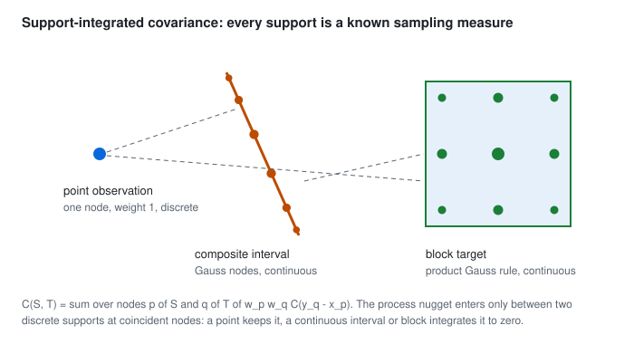

# Kriging and cokriging

`geocond.kriging.predict` solves one local system per target support: simple, ordinary or universal kriging of one
variable, or coupled cokriging of several, on covariance integrated over each observation's and each target's
sampling support. `geocond.neighborhood` decides which observations enter each system, and `geocond.baselines`
gives the nearest-neighbour and inverse-distance references a kriging result is compared with.

## The shared system

Let $C$ be the covariance of the selected observations, $\mathbf c$ their covariance with the target support, $F$ the
drift design and $\mathbf f_0$ the drift at the target. The weights solve

$$\begin{bmatrix} C & F \\ F^{\mathsf T} & 0 \end{bmatrix}
\begin{bmatrix} \mathbf w \\ \boldsymbol\lambda \end{bmatrix} =
\begin{bmatrix} \mathbf c \\ \mathbf f_0 \end{bmatrix}, \qquad \hat z_0 = \mathbf w^{\mathsf T} \mathbf z,$$

and the error variance is the explicit quadratic

$$\sigma_K^2 = C_{00} - 2\,\mathbf w^{\mathsf T}\mathbf c + \mathbf w^{\mathsf T} C\, \mathbf w .$$

The quadratic form avoids any ambiguity about the sign of the Lagrange multiplier between covariance and variogram
formulations; for the augmented system it equals $C_{00} - \mathbf w^{\mathsf T}\mathbf c -
\boldsymbol\lambda^{\mathsf T}\mathbf f_0$. A materially negative variance (below $-10^{-10}$ of the sill) is a failed
model or solve and is reported as such, never clamped to zero.

- **Simple kriging** has no drift and a known mean: $\hat z_0 = m + \mathbf w^{\mathsf T}(\mathbf z - m)$ with
  $C\mathbf w = \mathbf c$.
- **Ordinary kriging** has one constant drift column: the weights sum to one and the mean is estimated locally.
- **Universal kriging** uses a declared drift: `"linear"` in $x, y, z$, `"quadratic"`, or covariates supplied as a
  function of position (they must exist at every observation and target support). The drift is averaged over each
  support and built on coordinates centred on the neighbourhood and scaled by its extent before its rank is checked.
  The covariance must describe the residual after the drift. A rank-deficient drift, such as a linear 3D drift with
  every observation on one line, fails the target: universal kriging is never silently replaced by ordinary kriging
  under its own label.

The solve uses float64 and a Cholesky factor of $C$ with the constraints handled through the Schur complement
$F^{\mathsf T} C^{-1} F$; no explicit inverse is formed.

## Cokriging

Observations of several variables are stacked, each with its own supports; primary and secondary variables need not
share locations, and no pseudo-pairs are made by proximity. $C$ holds the full cross-variable blocks of a linear model
of coregionalization, so the system is coupled: it is not a set of independent univariate solves labelled cokriging.

**Traditional ordinary cokriging** puts one indicator column per variable in $F$ and sets the constraint vector to the
unit vector of the target variable: the target variable's weights sum to one and every other variable's weights sum
to zero. A single secondary observation therefore always receives zero total weight; that is the consequence of these
constraints, not a defect. **Simple cokriging** instead uses one known mean per variable. Predicting several variables
jointly (`target_variable=(0, 1)`) returns, per target, the full error covariance

$$\Sigma_{tu} = C_{00,tu} - \mathbf w_t^{\mathsf T}\mathbf c_u - \mathbf c_t^{\mathsf T}\mathbf w_u +
\mathbf w_t^{\mathsf T} C\, \mathbf w_u,$$

whose diagonal holds the variances and whose off-diagonal is the prediction errors' cross covariance.

Cokriging can help where a correlated secondary variable is denser or more continuous. It does not guarantee a lower
prediction error, particularly when every variable is sampled at the same places or the relationship is misspecified.

## Support: points, intervals and blocks

<picture>
  <source media="(prefers-color-scheme: dark)" srcset="../assets/support-integration-dark.svg">
  
</picture>

Every observation and target is a `Support`: a known sampling measure given as quadrature nodes and weights. The
covariance between two supports averages the model over both,

$$\bar C(S, T) = \sum_{p \in S} \sum_{q \in T} w_p\, w_q\, C(\mathbf y_q - \mathbf x_p),$$

so an interval observation integrates along its (desurveyed) interval and a block target over its volume. A point
placed at a block's centre is not a block estimate.

**The nugget depends on the measure.** The process nugget is a microscale structure: integrated over a continuous
interval or volume it contributes nothing, and between two discrete supports it contributes only where nodes
coincide. A point observation therefore keeps its nugget and is reproduced exactly at its own location, while a block
target does not carry the nugget in its own variance. This is gstat's continuous-block convention, and the reference
fixture shows the alternative explicitly: a literal average of eight distinct points would keep nugget/8 = 0.0125 more
variance. Declaring a support's measure as `"discrete"` or `"continuous"` makes the choice explicit.

**Measurement error is not the nugget.** Error variance is declared per observation, adds to the diagonal of the
observation covariance only, and the prediction targets the latent process: at an observed location it smooths
instead of reproducing the noisy value.

**Quadrature converges algebraically on self-covariance.** The covariance has a kink at zero separation, so a product
Gauss rule applied to a support's covariance with itself converges at second order, about fourfold per doubling of the
order, not spectrally. For a 10 m line and a spherical range of 40 m, the order-128 rule is within 1e-5 of the exact
$1 - \tfrac12 L/a + \tfrac1{20}(L/a)^3 = 0.87578125$. The order is therefore part of every recipe, and a block
estimate needs a convergence check against a finer rule.

## Neighbourhoods

A `Neighborhood` ranks observations by distance from the target support's centroid (ties by observation order) under a
declared metric: Euclidean metres, or $\lVert \operatorname{diag}(1/a) R^{\mathsf T}\mathbf h \rVert$ in range units for
an anisotropic search. It takes them in order within the radius, up to `max_samples` per variable (or in total), and
at most `max_per_group` from any one hole. Fewer than `min_samples` observations of a target variable, or fewer than
`min_groups` distinct holes, make the target **uninformed** with that reason, never an estimate from too little
support. Selection is not a covariance transformation.

## Solver policy and diagnostics

An observation covariance that is singular or has a condition number above $10^{12}$, the signature of duplicate or
near-duplicate supports, fails the target unless the call declares `solver={"jitter": fraction}`: a jitter of
$10^{-12}, 10^{-11}, \dots$ up to that fraction of the sill is then added to the diagonal until the condition is
acceptable, and the amount applied is reported. Exact duplicates of one variable at one support are refused when the
observations are built, unless their measurement error is declared.

Every estimated target carries its diagnostics: the selected observations and their distances, the weights, the
weight sum and contribution of each variable, the number of distinct holes, the Lagrange multipliers, the normalized
linear-system residual, the constraint residual, the covariance spectrum and condition number, the negative-weight
mass, and any regularization applied.

## Baselines

`nearest_neighbour` and `inverse_distance` estimate from the same eligible observations with the same neighbourhood.
They carry no variance (NaN, with the reason stated): a baseline implies no uncertainty, and a number that read like a
kriging variance would mislead.

## What the tests establish

| Question | Reference | Result |
|---|---|---|
| Univariate simple and ordinary kriging, three targets | R/gstat 2.1-6 predictions, variances and the independent weights | within 2e-10 |
| Coupled simple and ordinary cokriging, both variables jointly | gstat predictions, variances and error cross covariance | within 2e-10; ordinary weight sums exactly (1, 0) and (0, 1) |
| Does secondary information reach the primary prediction? | gstat: the third secondary value raised by 5 | the recorded primary changes, within 2e-10 |
| Zero cross covariance | the univariate solution | identical within 2e-10 |
| Secondary units multiplied by 1000 with the covariance transformed | the unscaled solution | primary prediction and variance unchanged; secondary variance scaled by 1e6 |
| An explicit eight-point target support | gstat block prediction and variance | within 2e-10 |
| The nugget over a continuous block, and over a finite point average | gstat's continuous convention; the independent finite average | both within 2e-10; they differ by exactly nugget/8 |
| Measurement error at the observed locations | gstat `Err` | within 2e-10, and the prediction smooths |
| A process nugget at the data | the data | reproduced exactly, zero variance |
| Ordinary and universal kriging, three families | PyKrige 1.7.3 `OrdinaryKriging3D`, `UniversalKriging3D` (regional linear drift) | predictions and variances within 1e-8 |
| Simple and ordinary kriging | GSTools 1.7.0 | within 1e-9 |
| Constant field; linear field with a linear drift; zero-nugget interpolation | the fields themselves | reproduced to 1e-9 |
| Rotation and translation with the anisotropy; values and model scaled | the untransformed solution | unchanged; mean scaled by b, variance by b^2 |
| Too few observations; a rank-deficient drift; near-duplicate supports | stated statuses | uninformed, failed and failed, each with its reason; a declared jitter rescues the last and is reported |
| Line self-covariance and block estimates as the quadrature order grows | the exact line integral | second-order convergence; block estimates settle monotonically |

For well-conditioned fixtures the dossier's proposed tolerances were a relative 1e-7 on predictions and variances and
residuals below 1e-9; the gstat comparisons meet the stricter 2e-10 the reference itself declared.

## References

- Pebesma, E. J. Multivariable geostatistics in S: the gstat package. *Computers & Geosciences* 30, 683-691 (2004).
  doi:10.1016/j.cageo.2004.03.012; and the current gstat references for `krige`, `predict.gstat` (block support,
  residual variograms) and `vgm` (`Nug` and `Err`), https://r-spatial.github.io/gstat/
- GeoStat Framework. PyKrige 1.7.3, `OrdinaryKriging3D` and `UniversalKriging3D`.
  https://geostat-framework.readthedocs.io/projects/pykrige/en/stable/
- Müller, S., Schüler, L., Zech, A. and Heße, F. GSTools v1.3. *Geoscientific Model Development* 15, 3161-3182
  (2022). doi:10.5194/gmd-15-3161-2022
- Genton, M. G. and Kleiber, W. Cross-covariance functions for multivariate geostatistics. *Statistical Science* 30,
  147-163 (2015). doi:10.1214/14-STS487
- Geostatistics Lessons. Kriging with constraints (2023), https://geostatisticslessons.com/lessons/krigingconstraints;
  Quantitative kriging neighborhood analysis (Barboza and Deutsch, 2024), https://geostatisticslessons.com/lessons/qkna;
  Choosing the discretization level for block property estimation (2020),
  https://geostatisticslessons.com/lessons/discretization
