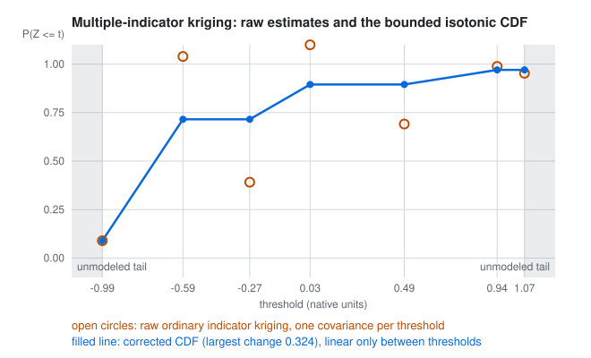
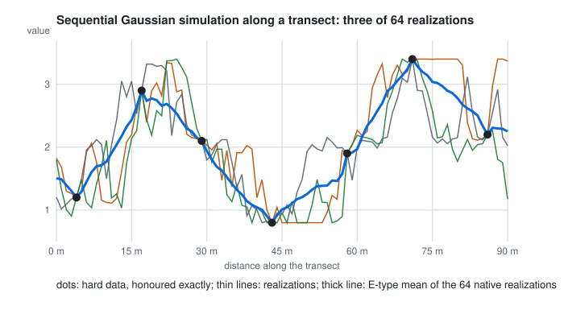

# Indicator probabilities and Gaussian simulation

Kriging gives one estimate and its error variance. Two other questions need other methods: the probability that a
value exceeds a threshold (`geocond.probability`, multiple-indicator kriging), and a set of equally probable maps that
reproduce the model's variability (`geocond.simulation`, sequential Gaussian simulation on normal scores).

## Multiple-indicator kriging

For ordered thresholds $t_1 < \dots < t_K$, each observation is coded as indicators $i_k = [z \le t_k]$, and ordinary
kriging of each indicator estimates the conditional distribution at the target (Journel 1983):

$$\hat F_k = \hat P(Z \le t_k \mid \text{data}) = \sum_\alpha w^{(k)}_\alpha\, i_k(\mathbf x_\alpha),$$

each threshold with its own indicator covariance fitted to its indicator variogram. The neighbourhood is one plan for
all thresholds: selection depends on geometry only, so every threshold uses the same observations at a target. This
answers a threshold question directly, which is different from drawing a threshold over an ordinary-kriging mean.

**Order-relation correction.** Separately kriged indicators need not be ordered or lie in $[0, 1]$. The published
distribution is the least-squares projection of the raw estimates onto
$\{0 \le F_1 \le \dots \le F_K \le 1\}$, computed as the pool-adjacent-violators solution clipped to $[0, 1]$: clipping
keeps a nondecreasing sequence nondecreasing, and for least squares the box and the order constraints separate. The raw
estimates and the size of the correction (largest and root-sum-square change) are kept with every result. This is a
chosen correction, not a reproduction of GSLIB's upward and downward averaging.

<picture>
  <source media="(prefers-color-scheme: dark)" srcset="../assets/mik-correction-dark.svg">
  
</picture>

The figure is a real result from the test data: seven thresholds with deliberately different indicator ranges, for the
target whose raw estimates needed the largest correction (0.324).

**Only the fitted thresholds carry probabilities.** Between two thresholds the distribution is interpolated linearly,
which keeps it monotone; below the first or above the last it is an **unmodeled tail**, reported as such and never
extrapolated, and no mean is computed from unspecified tails. The probabilities describe the support the indicators
were coded on (for composites, the composite-centre approximation), not block exceedance.

## Normal scores

Sequential Gaussian simulation works on normal scores. `NormalScoreTransform.fit` sorts the training values (with
declustering weights when given) and gives each distinct value the standard normal quantile of its weighted mid-rank
plotting position:

$$p_j = \frac{W_{<j} + w_j/2}{W}, \qquad y_j = \Phi^{-1}(p_j),$$

where $W_{<j}$ is the weight of the values strictly below value $j$, $w_j$ the weight of value $j$ and all its ties,
and $W$ the total. Ties share one score, so the transform is a frozen, deterministic table, recorded with the result.
Between knots the table is interpolated linearly in both directions.

**Tails.** The default tail policy is **bounded**: the training extrema are the endpoints, so a score beyond the table
maps to the minimum or the maximum. This bounds extrapolation, and the policy is recorded; the flat caps in the figure
below are this policy at work. A **declared** tail adds one knot on each side, a stated $(y, z)$ pair beyond the table,
for a broader-tail sensitivity recipe. A univariate transform does not make the joint distribution Gaussian: that is an
assumption of the method, not a consequence of the transform.

## Sequential Gaussian simulation

Each realization visits the target nodes along a seeded random path. At each node, simple kriging with mean zero in
normal-score space, on the original data and the nodes already simulated within the neighbourhood, gives the
conditional mean $\mu$ and variance $\sigma^2$; the node gets

$$y = \mu + \sigma\,\varepsilon, \qquad \varepsilon \sim N(0, 1),$$

with the innovation $\varepsilon$ recorded, and joins the conditioning set for the rest of the path. Realization $r$
draws its path and innovations from `numpy.random.default_rng([seed, r])`, so it can be regenerated alone. Hard data
are never altered: a node at a conditioning location takes its value exactly. Every realization is back-transformed
to native units.

<picture>
  <source media="(prefers-color-scheme: dark)" srcset="../assets/sgs-transect-dark.svg">
  
</picture>

**Why the algorithm is right.** With every datum and every earlier node in the neighbourhood, the sequence of
conditional draws in path order is exactly $\boldsymbol\mu + L\boldsymbol\varepsilon$, where $L$ is the Cholesky factor
of the dense conditional covariance ordered by the path. The tests reconstruct each realization that way from its
recorded innovations and match it to 1e-10. A limited neighbourhood approximates that conditional; it is declared with
the result.

**The search, in one part or two.** By default one neighbourhood is drawn from the original data and the nodes
already simulated together. Where nodes are dense and the data sparse (a drillhole's samples 1 m apart, the nearest
other hole 100 m away), the nearest candidates soon are all nodes: the realization stops seeing the data and drifts
toward the prior mean. With `node_neighborhood`, the search has two parts, as GSLIB's `sstrat = 0`: `neighborhood`
selects the original data, with the observations' group identities (so a per-hole cap applies) and its minimum, and
`node_neighborhood` selects the nodes already simulated (its `max_samples` is GSLIB's `ncnode`); the kriging system is
their union. GSLIB's example uses 8 data and 12 nodes. When both parts take everything, the two-part draw equals the
single one exactly. On a line of 40 nodes 40 m from four data holes under a short and a long nested structure, a
single search of 8 pulls the ensemble mean toward zero (0.89 against a dense conditional mean of 1.24), while 8 data
and 8 nodes searched apart keep it at 0.99. In Sondara's experiment on the Rocklea Dome test holes of its
hole-group split (Fe, 1 m samples, 32 realizations), 24 data (at most 6 per hole) and 12 nodes lowered the E-type
RMSE from 16.42 to 15.11 wt% against a single search of 24.

**Ensemble statistics are native.** The E-type mean, quantiles and exceedance frequencies are computed from the native
realizations. Back-transforming the Gaussian mean is not the native mean for a skewed variable, and the tests check
that the two differ. SGS conditions on support centroids (the point-support approximation), and it is the CPU
reference: the nodes of one path are simulated one after another from their current context; independent
realizations can run in parallel.

## What the tests establish

| Question | Reference | Result |
|---|---|---|
| Is PAVA the weighted least-squares nondecreasing fit? | a generic constrained solve (SLSQP), 50 random vectors | never worse than the generic optimum |
| Is the bounded projection PAVA clipped to [0, 1]? | a generic bounded QP, 50 random vectors | equal within 1e-6 |
| Does PAVA agree with scikit-learn? | `IsotonicRegression`, weighted and bounded | equal within 1e-12 |
| Indicators at the data | the data's own indicators | reproduced exactly |
| Different ranges per threshold | order and bounds | corrected CDFs are monotone and in [0, 1]; the correction is recorded |
| Outside the thresholds | tail status | unmodeled-tail, NaN |
| Normal scores | the mid-rank definition | exact for distinct, tied and weighted values; round trip at the knots |
| Tails | bounded and declared policies | clipped to the extrema by default; extended only through declared knots |
| Full-neighbourhood SGS | the dense conditional Cholesky draw | equal within 1e-10 from the recorded innovations |
| Two-part search taking everything | the single search | equal exactly |
| Two-part search, data part | the grouped data selection at the first node of each path | the same system, at most 2 per group, mean within 1e-12 |
| Two-part search where nodes crowd the data out | the dense conditional mean on a 40-node line | mean error lower by more than 0.05 than a single search of the same size |
| Ensemble moments | the dense conditional mean and covariance, 4,000 realizations | within 0.05 and 0.06 |
| Hard data and seeds | the data | honoured exactly; the same seed reproduces, another differs |
| E-type mean | native ensemble mean | equal to it, and different from a back-transformed Gaussian mean |

## References

- Deutsch, C. V. and Journel, A. G. *GSLIB: Geostatistical Software Library and User's Guide*, 2nd ed. Oxford
  University Press, New York (1998), ISBN 0-19-510015-8; the SGSIM parameters `ndmax`, `ncnode` and `sstrat`,
  http://www.gslib.com/gslib_help/sgsim.html
- Isatis technical reference, Sequential Gaussian Simulations: data and already simulated nodes with separate maximum
  counts, https://docs.dataminesoftware.com/IsatisNeo/Latest/Isatis-Tech-Refs/SGS.html
- Journel, A. G. Nonparametric estimation of spatial distributions. *Journal of the International Association for
  Mathematical Geology* 15, 445-468 (1983). doi:10.1007/BF01031292
- Best, M. J. and Chakravarti, N. Active set algorithms for isotonic regression; a unifying framework. *Mathematical
  Programming* 47, 425-439 (1990). doi:10.1007/BF01580873
- scikit-learn developers. `IsotonicRegression`.
  https://scikit-learn.org/stable/modules/generated/sklearn.isotonic.IsotonicRegression.html
- Geostatistics Lessons. Multiple indicator kriging overview, https://geostatisticslessons.com/lessons/mikoverview;
  normal score transformation, https://geostatisticslessons.com/lessons/normalscore; the multivariate Gaussian
  assumption, https://geostatisticslessons.com/lessons/multigaussian; conditioning by kriging,
  https://geostatisticslessons.com/lessons/conditioningbykriging
- Pebesma, E. J. Multivariable geostatistics in S: the gstat package. *Computers & Geosciences* 30, 683-691 (2004).
  doi:10.1016/j.cageo.2004.03.012
