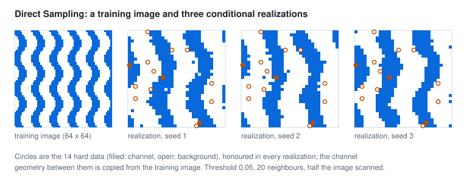

# Direct Sampling

`geocond.direct_sampling` simulates categorical and continuous variables by copying values from a training image (TI),
conditioned on hard data. Variograms describe two points at a time; a training image carries the multi-point
structure a variogram cannot, such as connected meandering channels. Direct Sampling (Mariethoz, Renard and
Straubhaar 2010) uses it without building a pattern database: at each node it searches the TI for a location whose
neighbourhood resembles the node's, and copies the value found there.

<picture>
  <source media="(prefers-color-scheme: dark)" srcset="../assets/direct-sampling-dark.svg">
  
</picture>

## The definition

The NumPy reference and the PyTorch scorer share one definition, so both select the same candidate at every node:

1. **Path.** A seeded permutation of the active cells that hold no hard data.
2. **Data event.** The `max_neighbors` nearest informed cells (hard data and cells already simulated) within
   `radius`, Euclidean in cells, ties broken by flat index. Their offsets $\mathbf d_i$ and values $v_i$ form the event.
3. **Candidate order.** The valid TI centres in a fresh uniform permutation for each node. The first acceptable
   candidate is then uniform among acceptable ones, so the copied values follow the TI's conditional frequencies (a
   fixed scan order would favour candidates that follow long gaps). A candidate whose pattern would leave the TI or
   touch a missing TI cell is skipped: the TI is never wrapped periodically.
4. **Mismatch.** With weights $w_i \propto \lVert \mathbf d_i \rVert^{-\delta}$ normalized to sum to one
   ($\delta$ = `distance_power`, 0 by default),

   $$D_\text{cat} = \sum_i w_i\, [\,\mathrm{TI}(\mathbf c + \mathbf d_i) \ne v_i\,], \qquad
   D_\text{cont} = \sqrt{\sum_i w_i \left(\frac{\mathrm{TI}(\mathbf c + \mathbf d_i) - v_i}{r}\right)^2},$$

   where $r$ is the range of the continuous variable in the TI, a training-only scale; with several variables the
   scores are averaged. Both lie in $[0, 1]$.
5. **Acceptance.** The first candidate in the node's order with mismatch at most the `threshold` wins; equality
   qualifies. When a `scan_fraction` of the candidates has been examined without one, the best candidate actually
   scanned is used (the earliest on ties) and the fallback is recorded. A node with no valid candidate is marked
   failed and left unwritten, and the result is marked incomplete.
6. **Copy.** The centre's value is copied: categories are TI codes, never averaged or interpolated. Hard data are never
   altered, a hard category absent from the TI is refused, and two different hard values in one cell are a conflict.

Every simulated cell records the TI candidate it copied (flat index, x-fast), its mismatch, whether it fell back, and
how many candidates were examined; the result records the path, the hard-data and active masks and whether it
completed. Array axes are (x, y, z[, variable]). The TI and the grid share cell size and orientation; rotating or
scaling a TI is a model intervention this function does not perform.

## CPU and CUDA: the same candidate, and when each is faster

The CUDA scorer evaluates a chunk of candidates in parallel but takes the earliest acceptable one in the node's order,
never the best of the chunk, which would change the method. Its scores equal the reference's bit for bit: every
operation is an IEEE float64 addition, multiplication or square root in the same order on both backends, and both
multiply by precomputed reciprocals where a division would appear (PyTorch turns a division by a scalar into a
reciprocal multiplication on its own, which is how a first version of this code came to differ in the last bit).

A GPU's presence is not a speedup. The recorded benchmark (`docs/assets/direct-sampling-benchmark.json`, from
`scripts/benchmark_direct_sampling.py`), each backend at its default chunk (1,024 candidates on NumPy, 65,536 on
PyTorch), on an Intel laptop CPU and an RTX 4070 Laptop GPU:

| Case | Nodes | Mean candidates scanned / valid | NumPy | CUDA | Same candidates and scores |
|---|---|---|---|---|---|
| categorical channels, TI 64 x 64, grid 32 x 32, threshold 0, full scan | 1,024 | 713 / 4,096 | 1.24 s | 3.67 s | yes |
| categorical channels, TI 128 x 128, grid 32 x 32, threshold 0, full scan | 1,024 | 2,266 / 16,384 | 2.57 s | 2.28 s | yes |
| categorical channels, TI 40^3, grid 16^3, threshold 0, scan 0.25 | 4,096 | 1,683 / 64,000 | 11.87 s | 15.06 s | yes |
| categorical channels, TI 64^3, grid 8^3, threshold 0, full scan | 512 | 4,710 / 262,144 | 4.98 s | 4.84 s | yes |
| continuous smooth field, TI 64 x 64 x 16, grid 10 x 10 x 4, threshold 0.02 | 400 | 8,830 / 65,536 | 2.85 s | 1.88 s | yes |

First-match search usually stops early (a few thousand candidates even in a 262,144-cell image), so per-node overheads
dominate: the permutation drawn on the host, the transfer and a synchronization per chunk. On these sizes the CUDA
scorer is a validated equal, not a faster engine; it gains where scans run long. Running independent realizations
concurrently is the natural next use of the GPU, and it is not implemented here. Simulating many nodes at once from
one stale context would be a different algorithm and is not offered.

## What the tests establish

| Question | Result |
|---|---|
| Does the NumPy engine follow the definition? | identical realization and candidate for every node against a plain-Python enumeration of the definition, for categorical, continuous, multivariate and distance-weighted cases |
| Does CUDA select the same candidate? | identical candidates, realizations, scores, fallbacks and scan counts, categorical, continuous and masked (run locally; CI has no GPU) |
| Are copied values distributed as the TI's conditional frequencies? | 1,500 single-node draws within four binomial standard errors of the TI's frequency |
| Does a mismatch equal to the threshold qualify? | yes at 0.25; at 0.2499 the node falls back after scanning the whole TI |
| Fallback, a missing-cell TI mask, a one-category TI, domain masks, hard data and conflicts | recorded fallback; failed and incomplete; one category everywhere; inactive cells unwritten; hard data exact; conflicts and absent categories refused |
| Do realizations keep the TI's proportion and continuity? | a stationary channel TI: mean proportion of six realizations within 0.06, lag-one variograms along both axes within a factor 0.6 to 1.7 |
| Cancellation | raises, with no partial result |

A first structural test used a channel image with too few repetitions: its edges and interior held different
proportions, candidates near edges are excluded for long offsets, and the realizations followed the interior. The
test now uses a stationary image; the lesson is that a TI's stationarity is part of the model, not of the engine.

## References

- Mariethoz, G., Renard, P. and Straubhaar, J. The Direct Sampling method to perform multiple-point geostatistical
  simulations. *Water Resources Research* 46, W11536 (2010). doi:10.1029/2008WR007621
- Strebelle, S. Conditional simulation of complex geological structures using multiple-point statistics.
  *Mathematical Geology* 34, 1-21 (2002). doi:10.1023/A:1014009426274
- Hansen, T. M., Vu, L. T. and Bach, T. MPSLIB: a C++ class for sequential simulation of multiple-point statistical
  models. *SoftwareX* 5, 127-133 (2016). doi:10.1016/j.softx.2016.07.001
- Gravey, M. and Mariethoz, G. QuickSampling v1.0: a robust and simplified pixel-based multiple-point simulation
  approach. *Geoscientific Model Development* 13, 2611-2630 (2020). doi:10.5194/gmd-13-2611-2020
