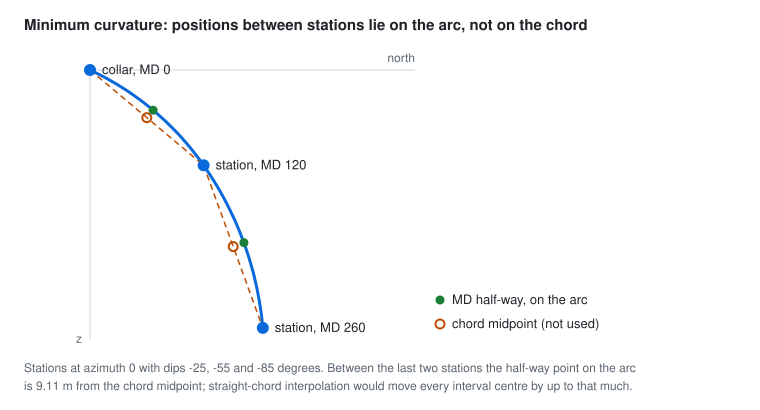
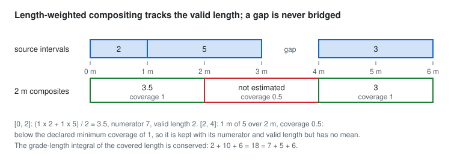

# Trajectories, supports and compositing

Every covariance, variogram and estimate in GeoCond is computed between positions, and a drillhole observation has
no position until its measured depth is placed on the hole's path. `geocond.geometry` turns a collar and survey
stations into that path, `geocond.support` turns a known sampling measure into quadrature nodes and weights, and
`geocond.compositing` averages known continuous intervals over new intervals while keeping the length that was
actually sampled.

## Conventions

GeoCond uses one convention and converts nothing internally: $x$ is east, $y$ is north, $z$ is elevation, positive
upward; azimuth $a$ is clockwise from grid north; dip $d$ is measured from the horizontal and is negative downward. A
caller holding true or magnetic bearings, or inclination from the vertical, converts once before calling. The unit
tangent of a station is

$$\mathbf t(a, d) = (\cos d \,\sin a,\; \cos d\, \cos a,\; \sin d).$$

## Minimum curvature

Between consecutive stations with tangents $\mathbf t_0$ and $\mathbf t_1$, separated by measured length $L$, minimum
curvature places the path on the circular arc that leaves along $\mathbf t_0$ and arrives along $\mathbf t_1$. With the
dogleg angle and ratio factor

$$\beta = \operatorname{atan2}\!\left(\lVert \mathbf t_0 \times \mathbf t_1 \rVert,\; \mathbf t_0 \cdot \mathbf t_1\right),
\qquad RF = \frac{2 \tan(\beta / 2)}{\beta}, \qquad \Delta \mathbf r = \frac{L}{2}\, RF\, (\mathbf t_0 + \mathbf t_1).$$

The `atan2` form keeps $\beta$ accurate at small angles, where $\arccos$ of a dot product loses precision.

A position between stations is taken on the arc, never on the chord. At fraction $f$ of the section, with
$\mathbf n = (\mathbf t_1 - \cos\beta\, \mathbf t_0) / \sin\beta$ the in-plane normal,

$$\mathbf r(f) = \mathbf r_0 + \frac{L}{\beta}\left(\sin(f\beta)\, \mathbf t_0 + 2 \sin^2\!\frac{f\beta}{2}\, \mathbf n\right),
\qquad \mathbf t(f) = \cos(f\beta)\, \mathbf t_0 + \sin(f\beta)\, \mathbf n .$$

<picture>
  <source media="(prefers-color-scheme: dark)" srcset="../assets/minimum-curvature-dark.svg">
  
</picture>

How `Survey` decides each boundary case:

- **Straight sections.** Below a dogleg of $10^{-8}$ radians the arc formula is replaced by its second-order expansion
  $\mathbf r(f) = \mathbf r_0 + L f\left((1 - f/2)\,\mathbf t_0 + (f/2)\,\mathbf t_1\right)$, which is exact for
  equal tangents and continuous with the arc.
- **Antiparallel tangents.** When $\pi - \beta < 10^{-7}$ the arc's plane is undetermined; the survey is rejected,
  not resolved by an arbitrary choice.
- **Azimuth wrap.** Tangents are compared as vectors, so a turn from 359 to 1 degrees is a 2 degree dogleg, never a
  358 degree one.
- **Station order.** Measured depths must be nonnegative and strictly increasing; the arrays are copied and frozen, so
  a caller's later edit cannot move a built survey.
- **Extensions.** A first station below the collar, or an evaluation beyond the last station, is an error unless the
  caller declares `start_extension="tangent"` or `end_extension="tangent"`. Extended positions follow the first or last
  tangent in a straight line, and `Survey.at` returns a per-depth `extended` flag so the extrapolated part stays
  visible downstream.
- **Missing surveys.** GeoCond does not invent stations. A hole with only a recorded collar direction is a one-station
  survey with a declared end extension; an assumed vertical hole is the same with dip $-90$. Which of the two a hole
  is, and whether it was measured, is the caller's label to carry.

## Supports

A `Support` is a known sampling measure: nodes, nonnegative weights that sum to one, a kind and a measure. The kind is
declared (`point`, `line`, `trajectory`, `block` or `weighted`) and the measure is `discrete` or `continuous`; the
measure decides whether the process nugget survives between two supports (see
[Kriging and cokriging](03_kriging.md)).

- `point_support`: one node of weight one, discrete.
- `line_support`: a Gauss-Legendre rule on a straight segment.
- `trajectory_support`: a Gauss-Legendre rule on each survey section the interval crosses, with weights proportional to
  the section's share of the interval, so a composite on a curved hole integrates along the arc and not along its
  chord.
- `block_support`: a tensor-product Gauss-Legendre rule over a rectangular block, optionally rotated by a proper
  rotation matrix.
- `Support(..., kind="weighted", measure=...)`: an explicit measure, which must state whether it is discrete or
  continuous.

There is no support for unknown weights. A historical sampling envelope whose components and weights were never
recorded cannot be built as a `Support`, so it cannot enter support-integrated covariance by accident. Block
discretization is a numerical choice to test against finer rules, not a universal constant.

## Compositing

For a composite interval $J$ and known continuous source intervals $I_i$ with values $z_i$ and overlaps
$\ell_i = \lvert J \cap I_i \rvert$,

$$\bar z_J = \frac{\sum_i \ell_i z_i}{\sum_i \ell_i}, \qquad \mathrm{coverage}_J = \frac{\sum_i \ell_i}{\lvert J \rvert}.$$

`composite_intervals` returns more than the mean. Each `Composite` holds the numerator $\sum_i \ell_i z_i$, the valid
length $\sum_i \ell_i$, the missing length, the coverage, the domain and every parent with its overlap length.

<picture>
  <source media="(prefers-color-scheme: dark)" srcset="../assets/compositing-dark.svg">
  
</picture>

- **Missing values and gaps are missing length.** A NaN value or an unsampled gap adds to the missing length and
  never to the numerator as a zero.
- **Declared minimum coverage.** A composite whose coverage is below `min_coverage` keeps its numerator and valid
  length but has status `insufficient-coverage` and no mean. With complete coverage and no dropped residual, the
  length and the grade-length integral are conserved exactly.
- **Domains.** Domain labels add boundaries where the label changes, so no composite mixes two domains. A composite
  that would still cross unresolved domains is an error.
- **Overlaps and envelopes are refused.** Overlapping source intervals need a resolved observation policy first, and
  any `support_kind` other than `continuous-interval` is rejected. Compositing a sampling envelope of unknown weights
  would invent the averaging it claims to perform.
- **Residuals are explicit.** `fixed_boundaries(start, end, length, residual="keep")` keeps a final short interval as
  its own composite; `residual="drop"` removes it. Neither stretches it.
- **Categories.** `composite_categories` returns the length proportion of each code over the known length, the
  coverage and the missing length. It never averages integer codes. An unknown code stays unknown and is not
  redistributed.

Length weighting is not a mass balance when densities differ, and density-weighted compositing is not implemented.
The composite length is a model parameter: it changes the apparent variance and the short-range continuity, so a
1 m assay, a 5 m composite and a 10 m block are different supports.

## What the tests establish

| Check | Result |
|---|---|
| Vertical hole from a collar at 500 m; east-directed horizontal hole; constant arbitrary orientation | every position equals collar plus depth times the tangent, within 1e-12 |
| Quarter-circle bend of arc length $L$ | both in-plane displacements equal $2L/\pi$, and inserting an exact intermediate station gives the same curve, within 1e-12 |
| Azimuth wrap through north; antiparallel tangents | continuous path; the antiparallel survey is rejected |
| Extensions | refused unless declared; the `extended` flag marks extrapolated depths |
| welleng 0.29.1 `MinCurve`, an independent implementation | 12 seeded random surveys of 3 to 24 stations: stations and 40 arc interpolations each agree within $10^{-9}$ times the path length, doglegs within $10^{-9}$ degrees; also a near-straight section wrapping through north |
| Quadrature | a line rule integrates $x^4$ exactly; a block rule its second moment; a trajectory support on a quarter arc has the exact centroid |
| Supports | a sampling envelope or a weighted support without a declared measure is refused, as are negative weights and an improper rotation |
| Compositing fixture | $[0,1]$ at 2 and $[1,3]$ at 5 give $[0,2] = 3.5$ and $[2,3] = 5$, a grade-length integral of 12 and a valid length of 3 |
| Missing, domains, overlaps, residuals, categories | NaN adds missing length; domain labels split composites; overlaps and envelopes are refused; residuals are kept or dropped as declared; category proportions exclude unknown length |

## Sources

- Sawaryn and Thorogood, [A compendium of directional calculations based on the minimum curvature
  method](https://doi.org/10.2118/84246-PA), SPE Drilling and Completion, 2005.
- welleng contributors, [welleng](https://github.com/jonnymaserati/welleng), minimum-curvature utilities
  (`welleng.utils.MinCurve`), version 0.29.1, the independent reference used in the tests.
- Opengeostat, [PyGSLIB drillhole API](https://opengeostat.github.io/pygslib/API.html) and
  [resource estimation tutorial](https://opengeostat.github.io/pygslib/Tutorial.html), desurvey and compositing.
- Micromine, [Drillhole tools](https://onlinehelp.micromine.com/origin-beyond/en/mmdhole/IDH_DHOLE_OVERVIEW.htm),
  boundary-aware compositing.
- Joshi et al., [dh2loop 1.0](https://doi.org/10.5194/gmd-14-6711-2021), Geoscientific Model Development 14,
  6711-6728, 2021: desurvey and log harmonization as substantive preprocessing.
- Geostatistics Lessons, [Choosing the discretization level for block property
  estimation](https://geostatisticslessons.com/lessons/discretization), 2020.
